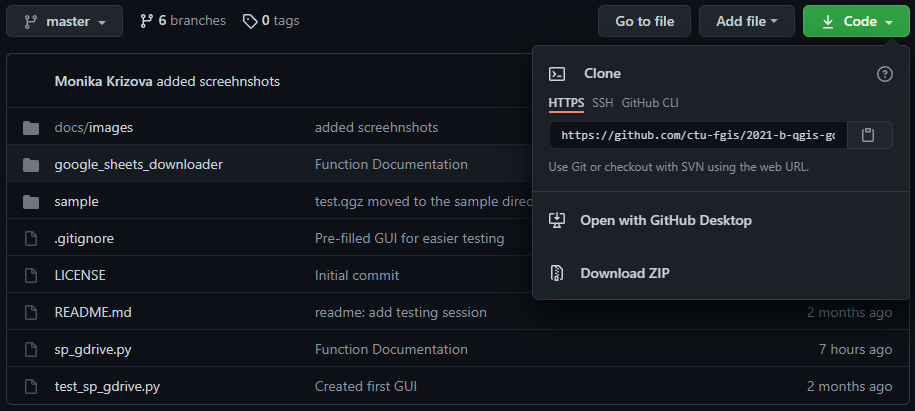
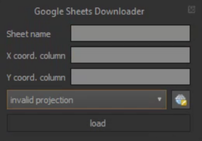
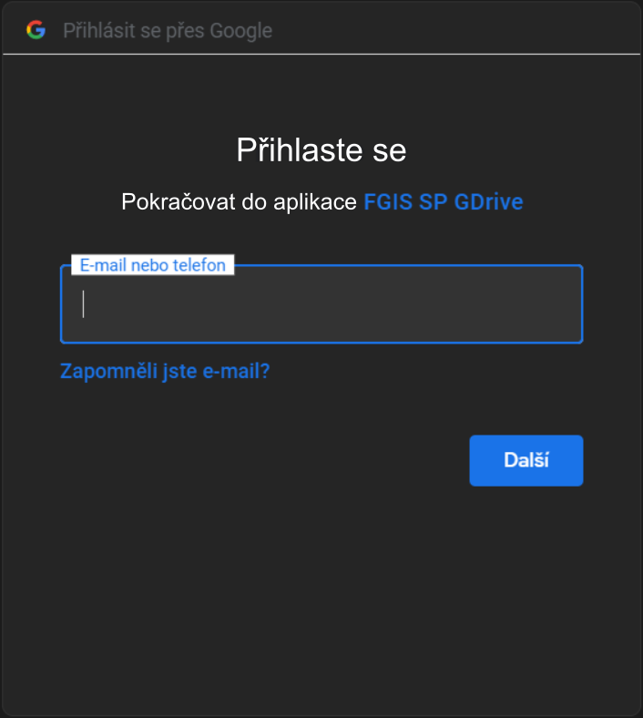
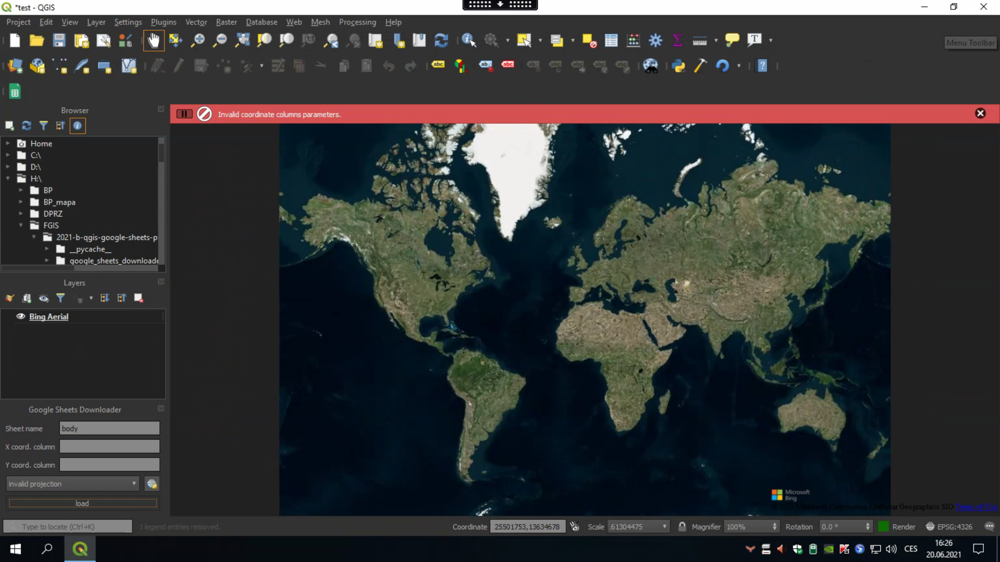
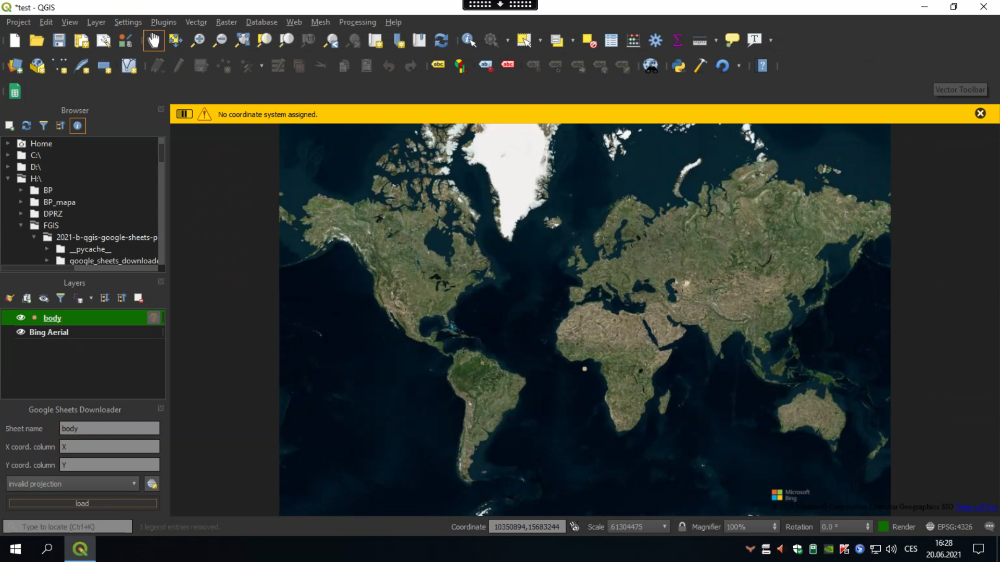

Google Sheets Downloader plugin
============================================
The GoogleSheetsDownloader plugin allows downloading data saved in Google Sheets and add them to the QGIS project as a point layer.
The plugin was created as a semestral project for the subject 155FGIS on CTU Prague.

Installing the plugin
-------------------------------
1. Download the plugin as a zip file from the GitHub repository.

2. Open "Manage and install plugins..." in your QGIS a select "Install from zip"

.. image:: images/install.PNG
   :width: 150%

3. Find your file in the file viewer and press "Install plugin", after the installing this icon will be added

.. image:: images/icon2.png  

4. Open OSGeo4W Shell and install library for accessing the GDrive API
_
   pip install --upgrade google-api-python-client google-auth-httplib2 google-auth-oauthlib           _
(plugin is now in the experimental mode, if you want to use it, you must contact creators to add your Google Account to the Google Cloud Platform)

How to work with the plugin
-------------------------------
1. After clicking on the plugin icon, the plugin will start

2. Fill in the table name, name of the columns with X and Y coordinate and select CRS

.. image:: images/plugin_filled.PNG

3. After clicking on load, it is necessary to go to the browser, log in to your GDrive account and enable all the permissions

4. Then your table data will be added to the current QGIS project

.. image:: images/map+points.PNG

------------------------------------

Possible problems during the work with the plugin 
------------------------------------------------------
No such file "..." located on your Google Drive account.
   * Possible problem: 
      The sheet's name was filled incorrectly or wasn't filled.

.. image:: images/error_no_such_file.PNG

Invalid coordinate columns parameters.
   * Possible problem: 
      Incorrect or no name of the column was filled.

No coordinate system assigned.
   * Possible problem: 
      Any coordinate reference system wasn't selected.

GDrive API
============================================
GDrive API allows you to create an app, which will access your GDrive documents. Using the GDrive app, it is possible to log into your GDrive account. 
After logging in a token.json file will be created and granted permission to download the requested files.

More information about the GDrive API `here <https://developers.google.com/drive/api/v3/about-sdk>`_

Source code
============================================
`https://github.com/ctu-fgis/2021-b-qgis-google-sheets-plugin <https://github.com/ctu-fgis/2021-b-qgis-google-sheets-plugin>`_

Error reporting
============================================
`https://github.com/ctu-fgis/2021-b-qgis-google-sheets-plugin/issues <https://github.com/ctu-fgis/2021-b-qgis-google-sheets-plugin/issues>`_
 
Authors
============================================
* Marek Hoffmann
* Monika Křížová

 `155FGIS - Free software GIS <https://geo.fsv.cvut.cz/gwiki/155FGIS_Free_software_GIS>`_, Faculty of Civil Engineering - CTU Prague, 2021

Supervisor: Ing. Martin Landa, Ph.D. 
              
Contents:

.. toctree::
   :maxdepth: 2

Indices and tables
==================

* :ref:`genindex`
* :ref:`modindex`
* :ref:`search`
